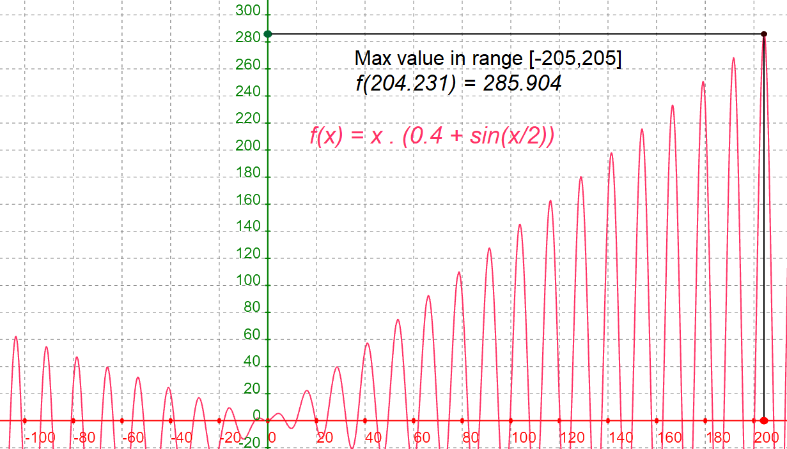

# Genetic Algorithm Library

The library provides a general genetic algorithm. It is simple, easy to use, and fast.

All you need to do is define the fitness function and its variables.
There are many examples of how to deal with classic genetic algorithms problems.

You can include it in any C++11 project as it does not require any external libraries.


# Features

- Support multiple data types.
- Customize many settings and options.
- Support both maximizing and minimizing problems.
- Several options for parents' selection method.
- Several options for the crossover method.
- Support option to kick out old individuals (dying of old age).
- Several termination conditions:
    - Reaching the fitness goal.
    - Reaching time limits.
    - Reaching the max number of iterations  (no improvement in the population for X iterations ).
    - Reaching the max number of generations.


## Quickstart, Building The Project
You can include this library by add all these files to your project: [src folder](src), [inc folder](inc). The main header file is `GeneticAlgorithm.h`.

Get started by downloading this repository and compiling the example which matches your problem.

```sh
git clone https://github.com/AliMarouf97/GeneticAlgorithm
cd GeneticAlgorithm/
mkdir build
cd build/
cmake ..
cmake --build .

ctest -C Debug
```

## Simple Maximization example ([Multi-peak function](examples/multi_peak_function/))

In the range [-205, 205] what is the maximum value of the function *f(x) = x * (0.4 + sin(x / 2))*.



There is only one variable (x) in this problem of float type. The chromosome must be of the same type.

| Variables type | Fitness function                    | Library object |
| ------------- | ------------------------------ |------------------------------ |
| `float`       | double fitnessFunction(`float` chromosome)| GeneticAlgorithm`<float>` ga(fitnessFunction);|

```C++
#include "..\GeneticAlgorithm.h"
#include <iostream>

double fitnessFunction(float chromosome)
{
    float x = chromosome;

    if (isnan(x) || isinf(x)) // if bad chromosome
        return -1e9;          // return very low fitness

    if (x > 205 || x < -205) // if out of range [-205,205]
        return -1e9;         // return very low fitness
    return x * (0.4 + sin(x / 2));
}

int main()
{
    GeneticAlgorithm<float> ga(fitnessFunction);
    ga.initializePopulation(400);
    auto best = ga.solve();
    std::cout << "Best: f(" << best.getChromosome() << ") = "<<best.getFitness()<<"\n";
    // Best: f(204.231) = 285.904
    return 0;
}
```

## Simple Maximization example ([Furniture manufacturer](examples/furniture_manufacturer/furniture_manufacturer.cpp))

A furniture manufacturer makes two types of furniture – chairs, and sofas.
The production of the sofas and chairs requires three operations – carpentry, finishing, and upholstery.

Manufacturing a chair requires 3 hours of carpentry, 9 hours of finishing, and 2 hours of upholstery.

Manufacturing a sofa requires 2 hours of carpentry, 4 hours of finishing, and 10 hours of upholstery.

The factory has allocated at most 66 labor hours for carpentry, 180 labor hours for finishing, and 200 labor hours for upholstery.
The profit per chair is $90 and the profit per sofa is $75.
How many chairs and how many sofas should be produced each day to maximize the profit?

Ranges:

| | Carpentry | Finishing | Upholstery | Max production |
|:-| :---: | :---: | :---: | :---: |
| **Chair** | 66/3 = 22 | 180/9 = 20 | 200/2 = 100 | 20 |
| **Sofa** | 66/2 = 33 | 180/4 = 45 | 200/10 = 20 | 20 |

In this problem, we have two integer variables (Chairs, Sofas). 
So we should create a structure and put these variables into it, and it will represent the chromosome datatype.

| Variables type | Fitness function                    | Library object |
| ------------- | ------------------------------ |------------------------------ |
| `struct Chromosome{`       |  |  |
| `byte chairs, sofas;`       | double fitnessFunction(`Chromosome` chromosome)| GeneticAlgorithm`<Chromosome>` ga(fitnessFunction);|
| `};`       |  |  |


```C++
#include <iostream>
#include "..\GeneticAlgorithm.h"

struct Chromosome
{
    byte chairs;
    byte sofas;
};

double fitnessFunction(Chromosome chromosome)
{
    int chairs = chromosome.chairs % 21; // [0,20]
    int sofas = chromosome.sofas % 21;   // [0,20]

    int carpentry = 3 * chairs + 2 * sofas;
    int finishing = 9 * chairs + 4 * sofas;
    int upholstery = 2 * chairs + 10 * sofas;

    if (carpentry > 66 || finishing > 180 || upholstery > 200) // if out of range
        return -1e9;                                           // return very low fitness

    return 90 * chairs + 75 * sofas;
}

int main()
{
    GeneticAlgorithm<Chromosome> ga(fitnessFunction, true, 100, 2, 20);
    ga.initializePopulation(100);
    auto bestFound = ga.solve();
    std::cout << "Best: Chairs = " << best.getChromosome().chairs % 21 << ", Sofas = " << best.getChromosome().sofas % 21 << ", $ = " << best.getFitness() << "\n";
    // Best: Chairs = 10, Sofas = 18, $ = 2250
    return 0;
}
```


# Parent's selection method
Available selection methods: `Fast, RouletteWheel, MixSelection`

Usage: in Constructer or via the function `setParentSelectionMethod`

```C++
ga.setParentSelectionMethod(Selection::Fast);
```

# Crossover method
Available crossover methods: `Uniform, OnePoint, TwoPoint, MixCrossover`

Usage: in Constructer or via the function `setCrossoverMethod`

```C++
ga.setCrossoverMethod(Crossover::Uniform);
```

# Genetic Algorithm Constructer

```C++
/**
 * @brief Construct a new Genetic Algorithm object
 *
 * @tparam T the type of the chromosome structure
 * @param fitnessFunction defines by user 'double fitness(T& chromosome)'
 * @param maximizeFitness true to Maximize the fitness, false to Minimize the fitness
 * @param maxGeneration put -1 for infinite generations
 * @param MutationPercentage Mutation percentage in the new generation
 * @param ElitePercentage Elite percentage in the population
 * @param selection parent selection method: 'Fast, RouletteWheel, MixSelection'
 * @param crossover crossover method: 'Uniform, OnePoint, TwoPoint, MixCrossover'
 */
GeneticAlgorithm(function<double(T &)> fitnessFunction, bool maximizeFitness = true, uint64_t maxGeneration = 500, double MutationPercentage = 1.5, double ElitePercentage = 15.0, Selection selection = Fast, Crossover crossover = Uniform);
```

# Enable kick out (dying of old age)
Individuals are allowed to reproduce in the community for a limited number of generations. After that, they are expelled regardless of their fitness.
This feature is disabled by default, you can enable it by setting the Kick Out Age.

Usage:

```C++
// void setKickOutAge(int kickOutAge, bool exceptBestOne = true)
ga.setKickOutAge(60,false);
```

# Termination Conditions
Terminate the solving process when one of the conditions occurs.
By default, only reaching the max generation will terminate the solving process.

## Max generation
Terminate the solving process after reaching `maxGeneration`, put -1 for infinite generations.

Usage: in Constructer or via the function `setMaxGeneration(uint64_t maxGeneration)`

```C++
ga.terminationConditions.setMaxGeneration(1000);
```

## Fitness Goal
Terminate the solving process after reaching the fitness goal.

Usage: via the function `setFitnessGoal(double goal)`

```C++
ga.terminationConditions.setFitnessGoal(705.92);
```

## Max Running Time (milliseconds)
Terminate the solving process after `maxRunningTime_ms` milliseconds

Usage: via the function `setMaxRunningTime_ms(int maxRunningTime_ms)`

```C++
ga.terminationConditions.setMaxRunningTime_ms(30000); // 30 s
```

## Max Iterations
Terminate the solving process after reaching `maxIterations` (no improvement in the population for `maxIterations` generation)

Usage: via the function `setMaxIterations(uint64_t maxIterations)`

```C++
ga.terminationConditions.setMaxIterations(200);
```

# Dealing with data types and ranges
Every problem has a special requirement. And because this is a general genetic algorithm library, you can define data types no matter what the problem type, but you have to set the range of each variable to improve the solving process.

## Integer Variables [0, n]
If the range of the variable is between 0 and n `[0, n]`, you can simply use a modulo operation ( `%` ) to round the remainder of the field. But the data type must be `unsigned`.

|Data Type | Short name | Range |
| :--- | :---: | :---: |
| unsigned char | byte, uint8_t | [0, 255] |
| unsigned short | uint16_t | [0, 65535] |
| unsigned int | uint32_t | [0, 4294967295] |
| unsigned long long | uint64_t | [0, 18446744073709551615] |

```C++
uint8_t x = 100;

/// my range [0,25[ , 25 is out of the range
uint8_t y = x % 25; // [0, 24]
```
See [Furniture Manufacturer Problem](examples/furniture_manufacturer/furniture_manufacturer.cpp),
[Housing Development Problem](examples/housing_development/housing_development.cpp),
[Find Password Problem](examples/find_password/find_password_decoder.cpp).

## Integer Variables [n, m] (n < m)
Regardless of whether n and m are positive or negative, the data type must be unsigned.

You can use these Macros `RANGE_ENCODER(mn, mx)` and `RANGE_DECODER(x, MOD, mn)`.

```C++
// Define range as Macros
#define MN -205
#define MX 205

// Save MOD to const int to reduce recalculating operations.
const uint16_t MOD = RANGE_ENCODER(MN, MX); // RANGE_ENCODER(mn, mx)

#define MY_DECODER(chromosome) ((int) RANGE_DECODER(chromosome, MOD, MN)) // RANGE_DECODER(x, MOD, mn)

// or define a function
// int MY_DECODER(uint16_t chromosome)
// {
//     return ((int) RANGE_DECODER(chromosome, MOD, MN));
// }
```
See [Multi-peak function (int)](examples/multi_peak_function/multi_peak_function_int.cpp) Problem.

## Floating Point Variables
The simplest way is to define a variable of type float and reject numbers out of range. In this way, the precision digits will be saved, but it may not be very efficient in the solving process. [ As we see in the first example above.](#simple-maximization-example-multi-peak-function))

|Data Type | Range | Digits of precision | Bytes |
| :--- | :---: | :---: | :--: |
| float | [-3.4E+38, 3.4E+38] | 6 | 4 |
| double | [-1.7E+308, +1.7E+308] | 15 | 8 |

*Another* way is to define the range and the number of digits precision using unsigned data type.

You can use these Macros `RANGE_ENCODER_F(mn, mx, POINTS) ` and `RANGE_DECODER_F(x, MOD, mn, POINTS)`.

```C++
// Define range as Macros
#define MN -205
#define MX 205

// Number of digits after floating point
#define POINTS 3

// Save MOD to const int to reduce recalculating operations.
const uint32_t MOD = RANGE_ENCODER_F(MN, MX, POINTS);

#define MY_DECODER(chromosome) ((double)RANGE_DECODER_F(chromosome, MOD, MN, POINTS))

// double MY_DECODER(uint32_t chromosome)
// {
//     return ((double) RANGE_DECODER_F(chromosome, MOD, MN, POINTS));
// }
```
See [Multi-peak function (float)](examples/multi_peak_function/multi_peak_function_float2.cpp) Problem.


## String / Arrays Varibles

### Define char array in chromosome structure
In this way, we want the algorithm to find the string within the field of all elements of char type, but it may not be very efficient in the solving process.

See [Find password](examples/find_password/find_password.cpp) Problem.

### Define index of char array in chromosome structure
In this way, we have the elements that may be within the string and we want to create a string of these elements.

See [Find password2](examples/find_password/find_password_decoder.cpp) Problem.

# Fix chromosome
We use Chromosome Fix Function to fix the chromosome when unwanted genes appear during the process of cross-over.
For example, when we are dealing with sorting problems and some elements are missing or repeated, we cannot compute the fitness until all elements are present.

First, we define the fix function `void fix(T& chromosome)`, T is the type of the chromosome structure. `Don't forget to pass chromosome as a reference using & mark`.

Then we set the Chromosome Fix Function. `Note: we must set the chromosome fix function before initializing the population.`
```C++
ga.setChromosomeFixFunction(fix);
```
See the [Traveling Salesman Problem](examples/traveling_salesman/traveling_salesman.cpp).

Other relative functions:
```C++
// Enable / Disable chromosome fix function
void setChromosomeFixFunctionStatus(bool status);
// Check if the chromosome fix function is enabled
bool isChromosomeFixFunctionEnabled();
```

